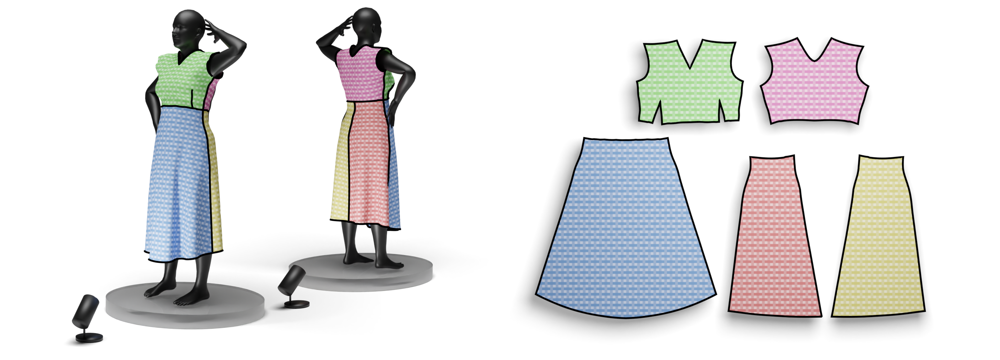
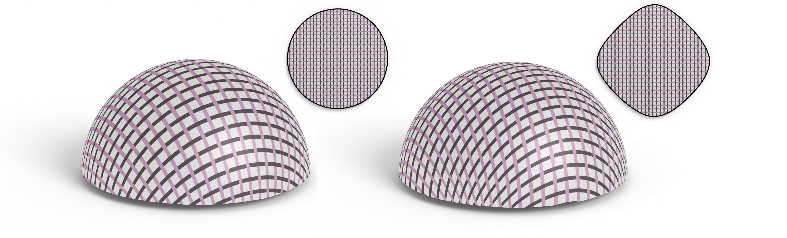
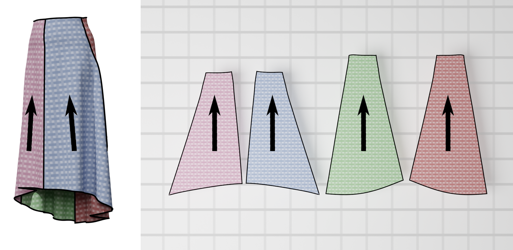
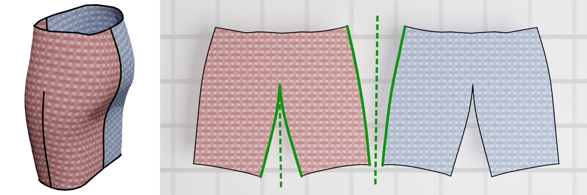
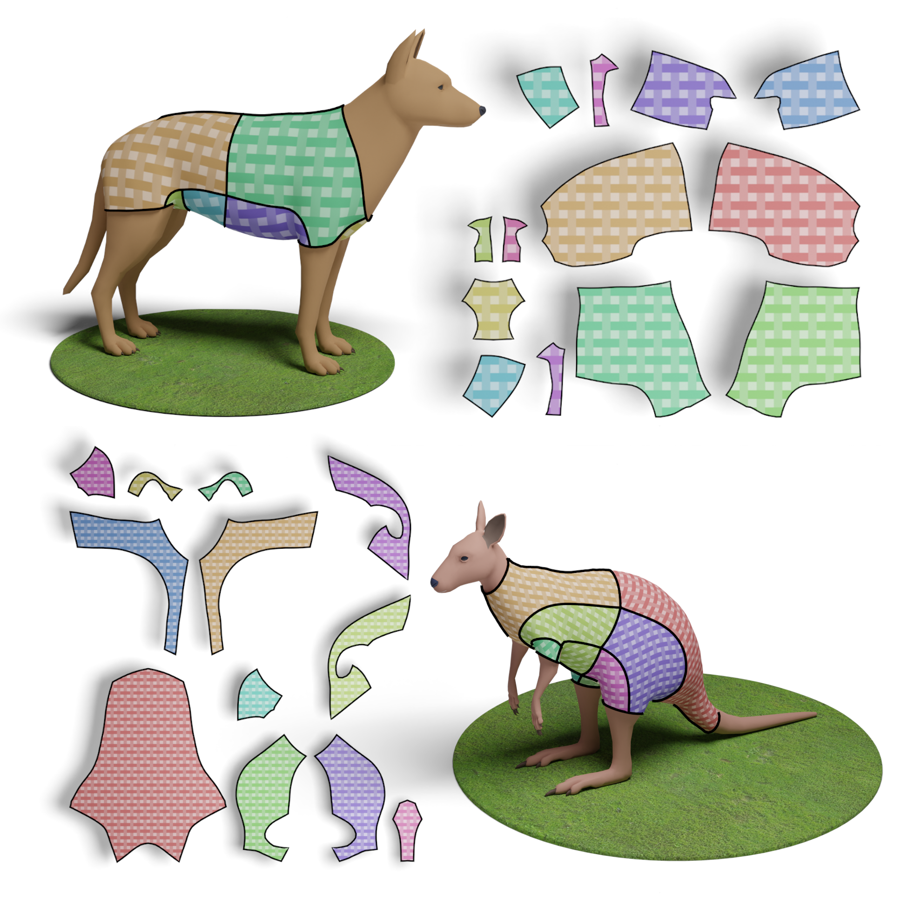

# GG WP: General Garment Woven Parameterization

*"If your pair of jeans isn't even isotropic, why should its paramerization be?"*

This repository provides an implementation of the anisotropic parameterization described in TODO by TODO.
It's original intent is to accurately flatten woven textiles, for which the thread structure induces
anisotropy in their ability to stretch.

 

## Features

* Shearing: we allow threads to shear, if this helps reduce stretch on the grain axes.

 

* Vertical alignment: patterns are aligned with the vertical axis in 3D.

 

* Reflectability: opposite sides or seams are constrainted to be a reflection. This makes sewing significantly easier.

 

* Multiple poses: given multiple target 3D meshes representing different poses, we produce a 2D pattern that best fits all targets. 

## Compiling

```
mkdir build && cd build
cmake ..
make -j woven_param
```

## Adding to your project

### TLDR

The CMakeLists at the root of this repo builds a library called `woven_param`, and the `include/param` directory contains the library's interface. Dont forget to init submodules (libigl, json).

### More detail

Can easily be added to CMake-based projects using

```
git add submodule https://github.com/corentinDumery/TODO
git submodule update --init --recursive
``` 

Then, in your `CMakeLists.txt`, add: 
```
add_subdirectory([path_to_woven_param]/woven-param)
target_include_directories([target] PUBLIC [path_to_woven_param]/include)
```

## Citing

Thank you for reading! If this repository is useful to you, feel free to reach out and/or cite our paper:

TODO

 

## Acknowledgments

Some of the models used in this repository are adapted from the dataset associated with https://github.com/maria-korosteleva/Garment-Pattern-Generator